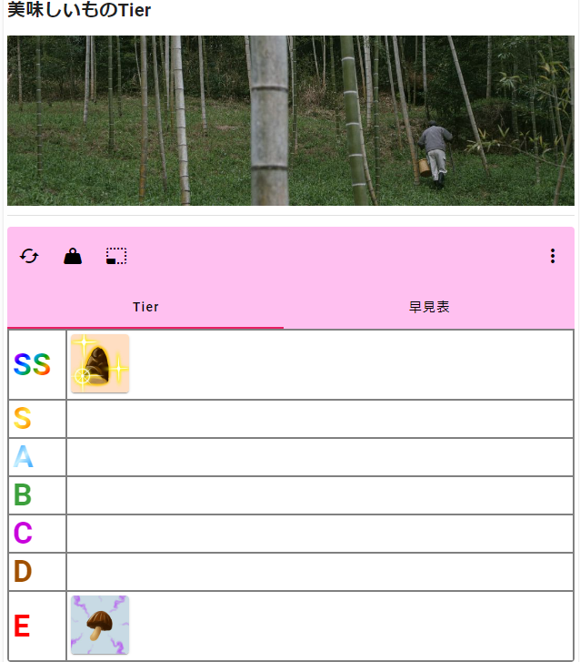
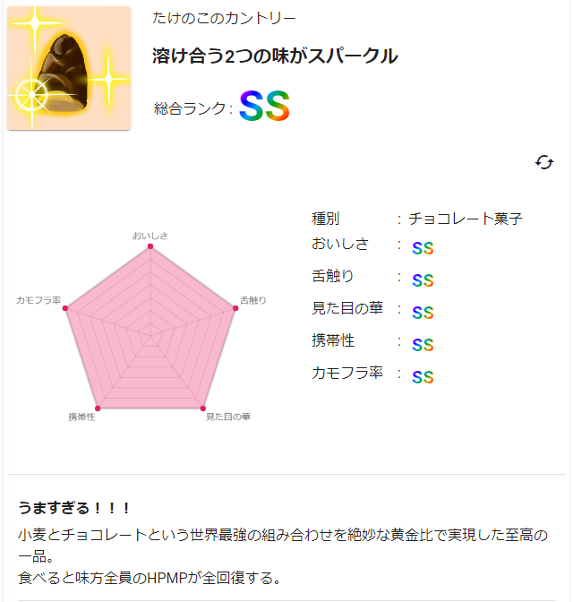

# kudo-tier-front （くどくどTierフロントエンド）
<a href="https://kd-tier.hopgn.com">
  </img>
</a>

このリポジトリは、WEBサイト[くどくどTier](https://kd-tier.hopgn.com)のフロントエンドのソースコードを公開するリポジトリです。

くどくどTierは、以下のような細かいレビューを交えたグラフィカルなTierを作成・管理・配信できるWEBアプリです。

</img>
</img>

## プロジェクト構成
くどくどTierプロジェクトの主な構成です。

* サーバー
  * プラットフォーム
    * AWS EC2 t2.micro
  * OS
    * Amazon Linux
  * メモリ
    * 1GB + Swap 1.8GB
  * ストレージ
    * 8GB
    * 20GB (Amazon EBS)
* 仮想化
  * Docker
* リバースプロキシ
  * nginx
* フロントエンド
  * アプリケーションプラットフォーム
    * Node.js
  * フレームワーク
    * Vue.js
  * UIフレームワーク
    * Vuetify
  * ビルド環境
    * Vue Cli
  * 言語
    * TypeScript
* バックエンド
  * WEBフレームワーク
    * Echo
  * ORMライブラリ
    * GORM
* バージョン管理システム
  * Git
* データベース
  * プラットフォーム
    * Amazon RDS db.t3.micro
  * ストレージ
    * 20GB
  * 管理システム
    * PostgreSQL

基本的な環境は`tier-reviews-server`リポジトリにDockerfileで纏めてあるので、ファイルを配置して`docker-compose up`コマンドを実行するだけでサーバーが機能します。

### ネットワーク図

### 開発環境
* エディタ
  * VS Code 
* フロントエンド
  * パッケージ管理システム
    * npm
  * ビルド環境
    * Vue Cli
* バックエンド
  * ホットリロードプラグイン
    * Air

### その他のサービス
* ドメイン
  * お名前.com
* TLS証明書
  * Let's Encrypt（更新にはcertbotを使用）

### WebHookを利用したデプロイ
GitHubの`tier-reviews`リポジトリにてpush（とプルリクエストによるマージ）を検知すると`Deployment Server`にWebhookが送信されます。Webhookのペイロードと証明書を検証し、`main`ブランチの変更が認められた場合は、以下の手順でデプロイします。

1. フロントエンドのサーバー停止
2. バックエンドのサーバー停止
3. フロントエンドのソースコードをビルド
4. バックエンドのソースコードをビルド
5. バックエンドのサーバーを起動
6. フロントエンドのサーバーを起動

また、デプロイを受理すると`202 Accepted`を返しますが、デプロイ自体は数分間続きます。その間はくどくどTierの利用はできず、プロキシが`502 Bad Gateway`を返します。

### certbotによる証明書の更新
証明書は`certbot`によって更新されます。
更新チェックのタイミングは以下の通りです。
* dockerコンテナが起動してから2分後
* 毎日3:00（UTC 18:00）

### データベースバックアップ
AmazonRDSによりAmazon S3へ自動バックアップ（14日間保持）
* 毎日04:00 (UTC 19:00)
