# くどくどTier v0.6.0 機能追加 要件・設計
## 目次
- [くどくどTier v0.6.0 機能追加 要件・設計](#くどくどtier-v060-機能追加-要件設計)
  - [目次](#目次)
  - [Tierのグルーピングを実装](#tierのグルーピングを実装)
    - [設計](#設計)
  - [Tierのグルーピング設定画面を実装](#tierのグルーピング設定画面を実装)
    - [設計](#設計-1)
  - [ページトップに戻るの実装](#ページトップに戻るの実装)
    - [設計](#設計-2)
  - [モバイルブラウザでもプレビューカードを表示する](#モバイルブラウザでもプレビューカードを表示する)
    - [設計](#設計-3)
  - [プレビューカードのツールを変更](#プレビューカードのツールを変更)
    - [設計](#設計-4)
  - [くどくどマッチング機能を新規に実装](#くどくどマッチング機能を新規に実装)
    - [くどくどマッチング作成の流れ](#くどくどマッチング作成の流れ)
    - [くどくどマッチング回答の流れ](#くどくどマッチング回答の流れ)
    - [設計](#設計-5)

## Tierのグルーピングを実装
Tierの評価項目に「情報」が設定してある場合、その情報に応じてTier上のレビューを各々の情報に応じてグルーピングする。

Tierのランクそれぞれにグルーピング機能を実装。

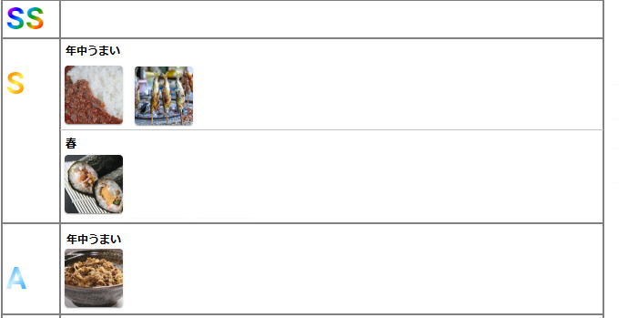

### 設計

## Tierのグルーピング設定画面を実装
Tier設定画面にセレクトボックスを設置する。
また、選択肢には「指定なし」も含める。

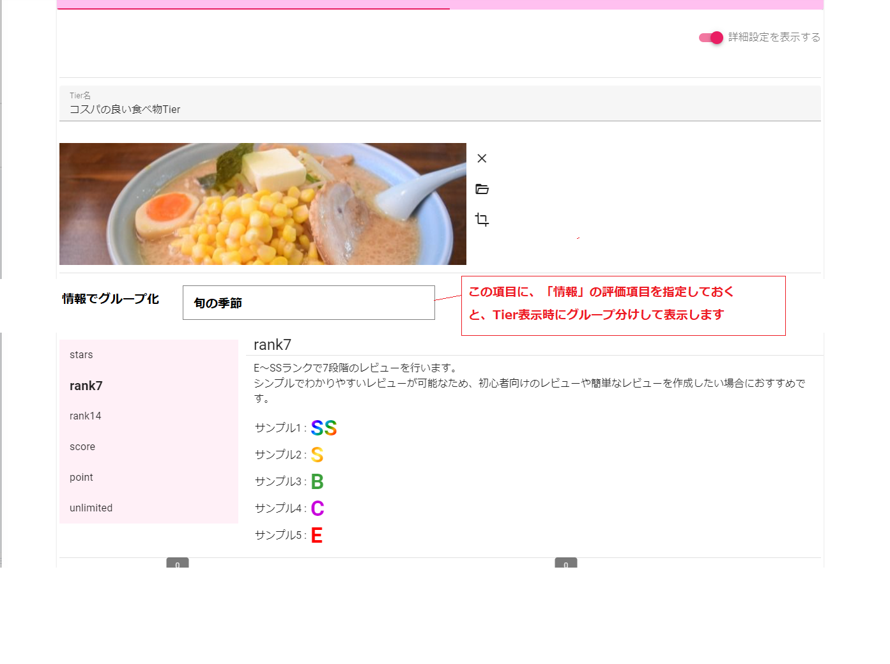

### 設計

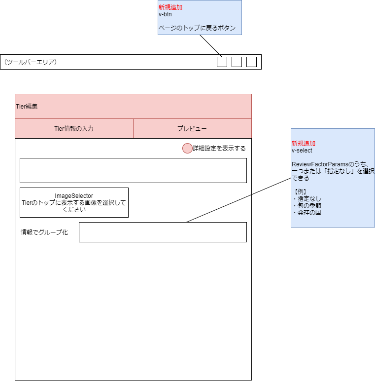

## ページトップに戻るの実装
編集の画面だけでも、「ページトップに戻る」を実装する

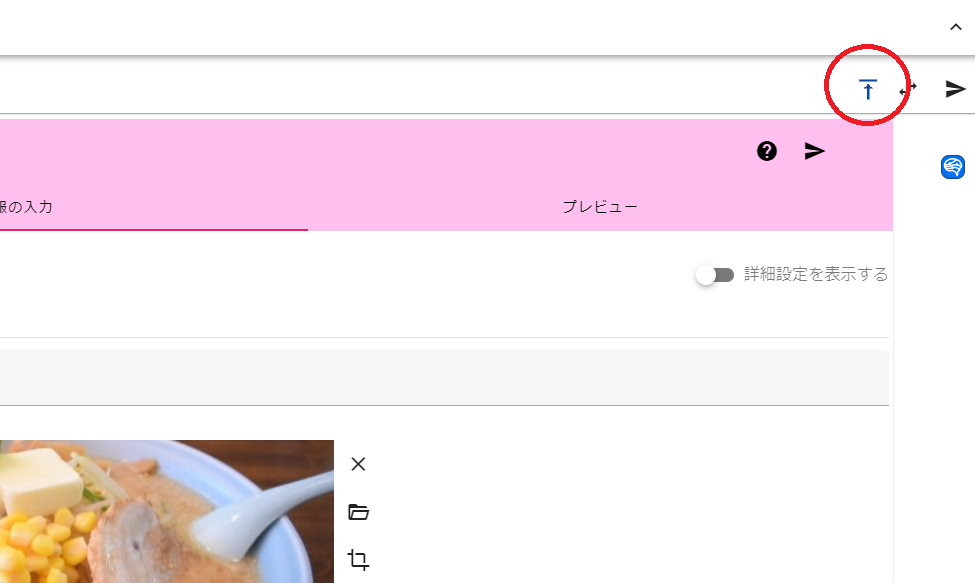

### 設計

## モバイルブラウザでもプレビューカードを表示する
現在、画面サイズxlの時のみ表示可能なプレビューカードを、モバイルを含めたすべての画面で表示可能にする。

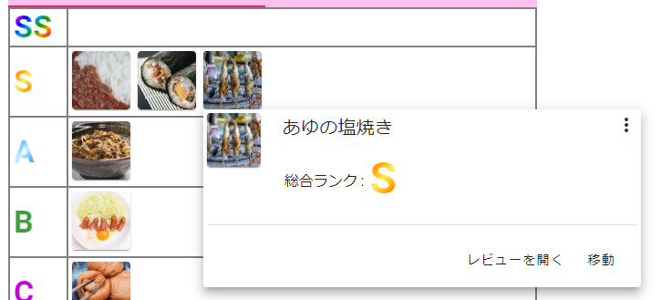

### 設計

## プレビューカードのツールを変更
ツールの下部と上部に散らばっていたツールを、下部に集約する。

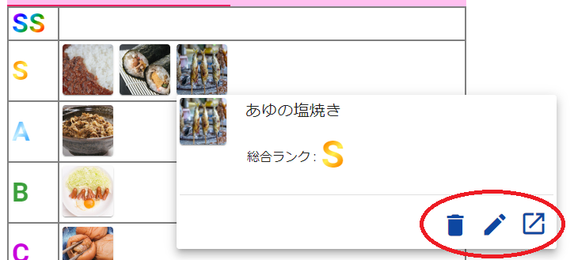

### 設計

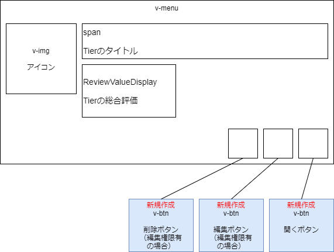

## くどくどマッチング機能を新規に実装
Tierに登録されているレビューの情報を利用してして、より多くの人に対してそれぞれの好みに合った情報を提供する機能。

平たく言うと、作成者はあらかじめ質問文を設定しておいて、回答者がそれに回答することでその回答者に合ったレビューを表示するという`おすすめの〇〇診断`のようなものです。

### くどくどマッチング作成の流れ
作成の流れとしては以下の通り

1. Tierを用意する
2. Tierからくどくどマッチングを作成する
   1. タイトル等の基本情報と説明文を設定
   2. 質問文と選択肢を設定

### くどくどマッチング回答の流れ
1. くどくどマッチングのページにアクセスする
2. くどくどマッチングに回答する
3. 回答の結果、もっとも適合率の高いレビューが1～3つほど表示される

### 設計
質問画面は以下の通り。

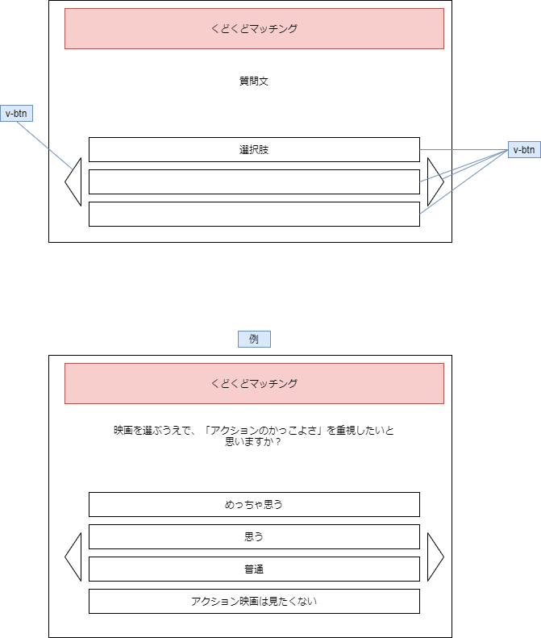

結果画面は以下の通り。

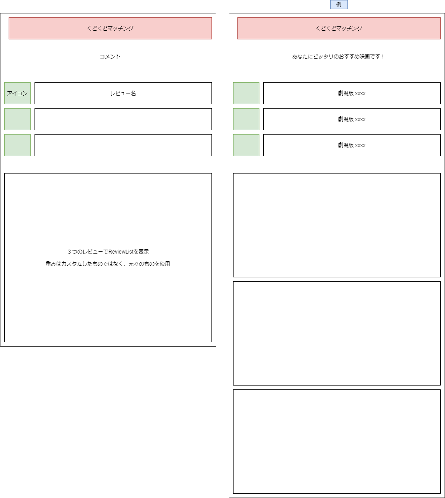

質問の設定画面は以下の通り。

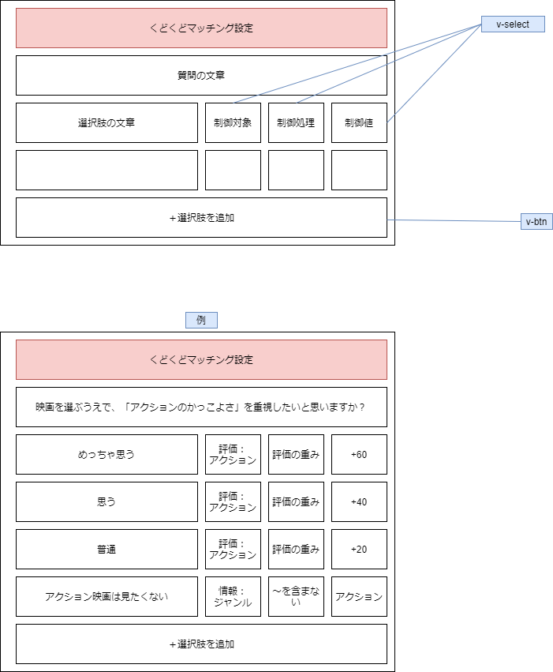

結果の設定画面は以下の通り。

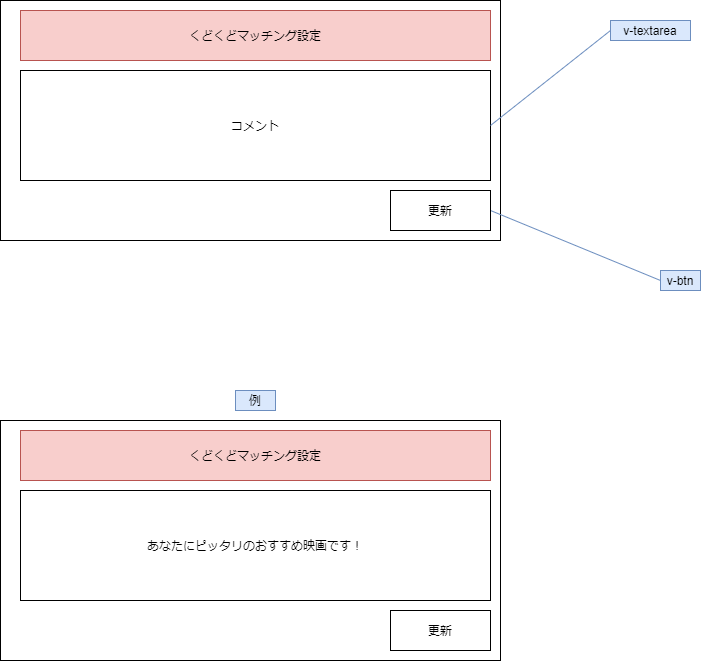

マッチングリストはホームに追加する。

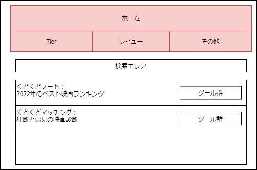
